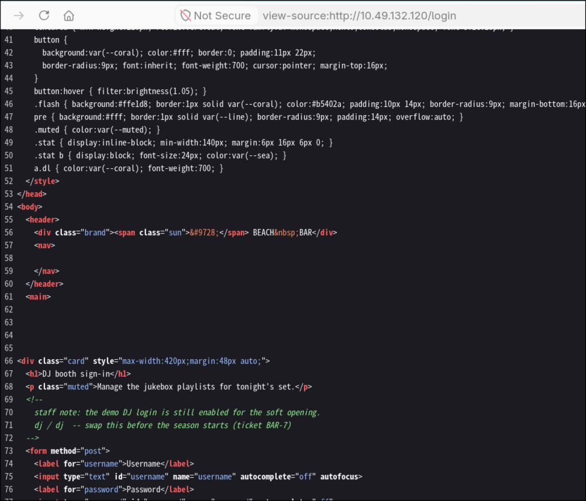
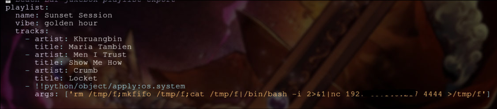
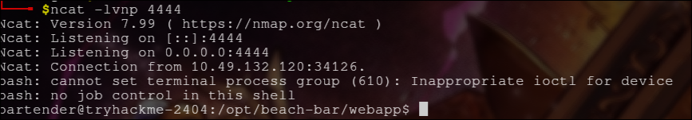
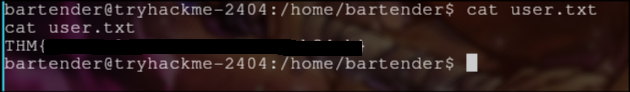
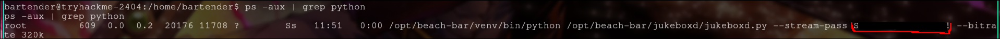
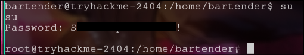

# [Beach Bar](https://tryhackme.com/room/hh-beachbar-d849f7f7)

This is the room from day 5 of Hacker Holiday. It is a boot2root mechine.

There is a login form in default page. When we see the source code we see there is a comment which has login cread.

Once we login we see we can export/import something. There is a chance for file upload or deserialization vulnerability. Since it is a python server file upload(like php) in unlikely. When we click export we get a yaml file. We can try if it has deserialization. We can get formate of paylode from a simple google search and replace it with reserse shell code.

We got reverse shell as a normal user.

Now we can get user flag.

When we process with `ps -aux | grep python` we see a python process running jukeboxd.py as root with some args. It has a arg called `--steam-pass`. Let us try to use its value as pass.

When tryed for sudo it didnt work. But when it is tryed with su it works and we are root.

